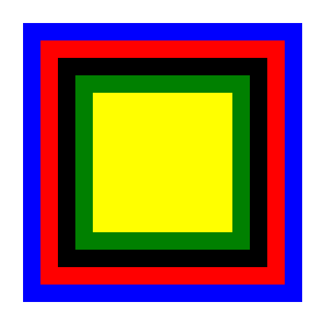
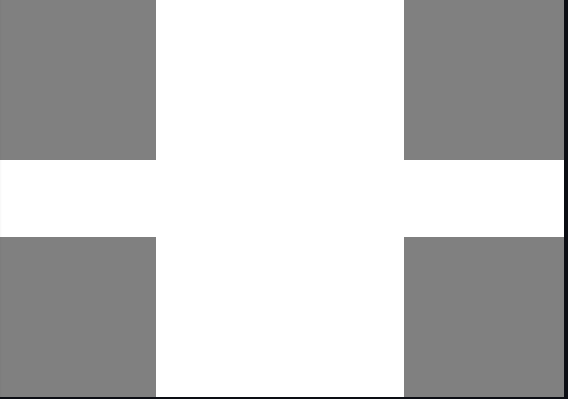
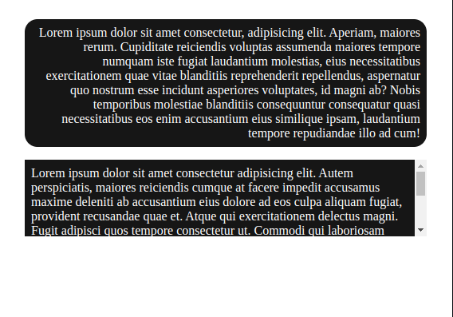
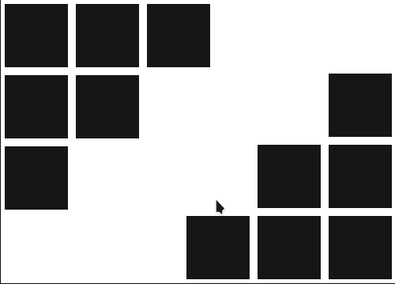

# Positions CSS

Atividade desenvolvida durante estudo na growdev com intuito de fixar conhecimentos sobre positions e float em CSS

## Atividade 1

## Atividade 2

## Atividade 3

## Atividade 4

